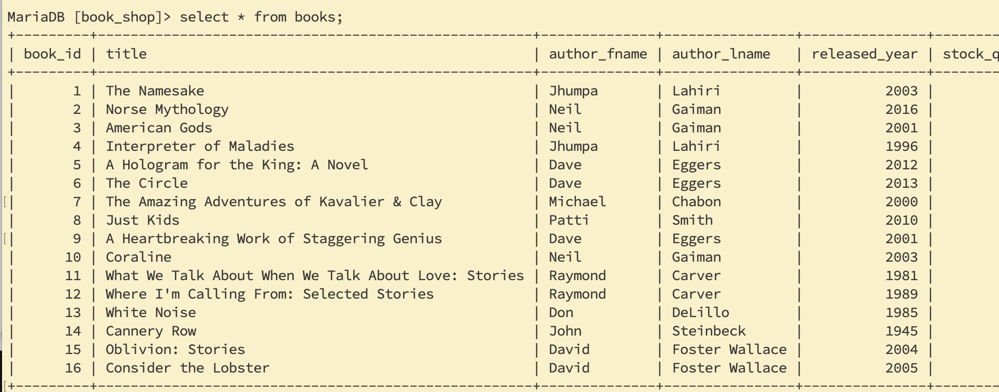
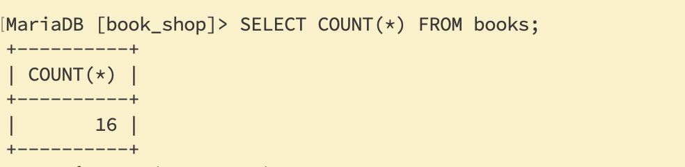
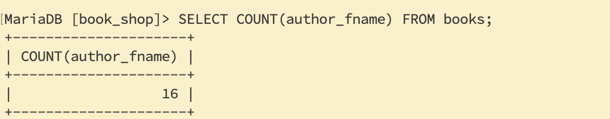
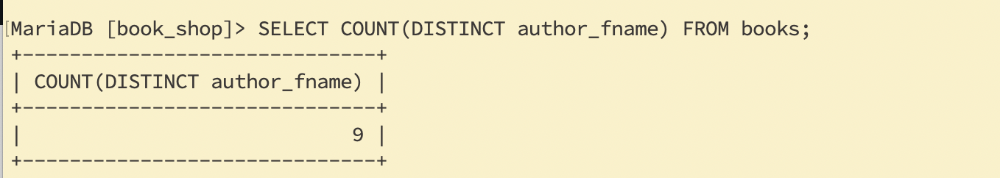
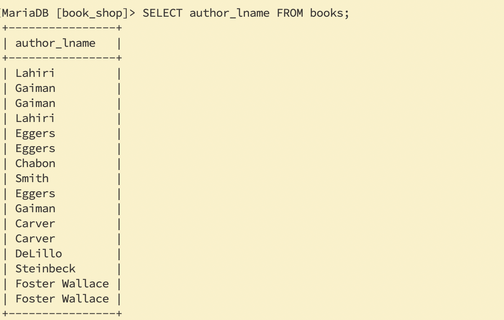
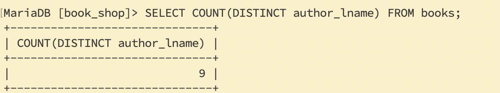
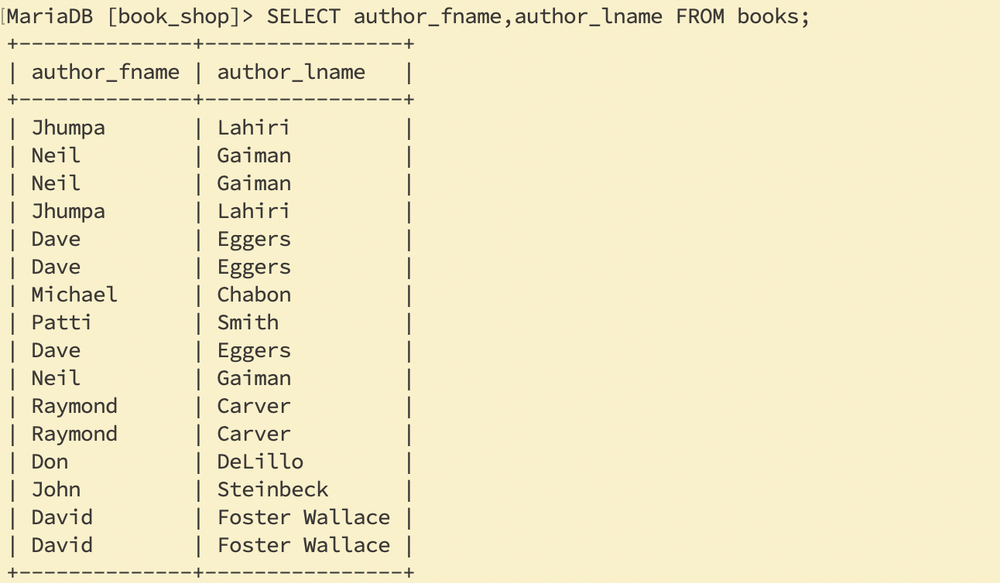
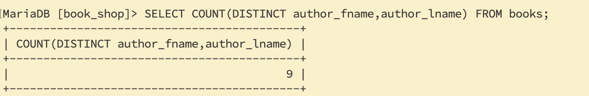
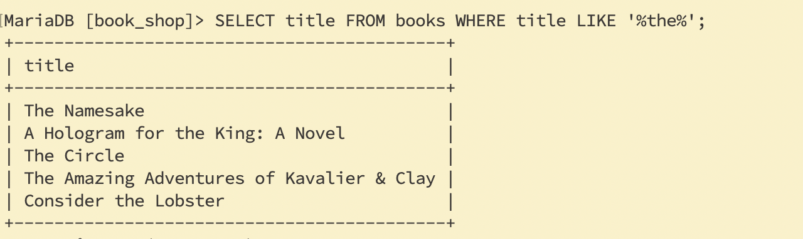
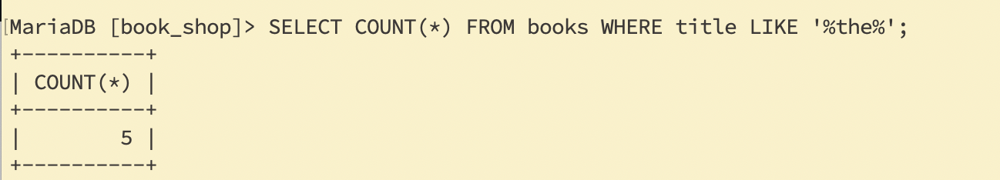

### Count Functions


---

---

---
- count distinct

---
- last name

---
- distinct last name

---
- select first name and last name

---
- distinct first name and last name

---
- How many titles contain "the"?

---


```sql
SELECT COUNT(*) FROM books;
 
SELECT COUNT(author_fname) FROM books;
 
SELECT COUNT(DISTINCT author_fname) FROM books;
 
SELECT COUNT(DISTINCT author_lname) FROM books;
 
SELECT COUNT(DISTINCT author_lname, author_fname) FROM books;
 
SELECT title FROM books WHERE title LIKE '%the%';
 
SELECT COUNT(*) FROM books WHERE title LIKE '%the%';
```