### Introduction to CURD
- CREATE
- READ
- UPDATE
- DELETE
---

### preparing DATA
- ` DROP TABLE CATS;`
---
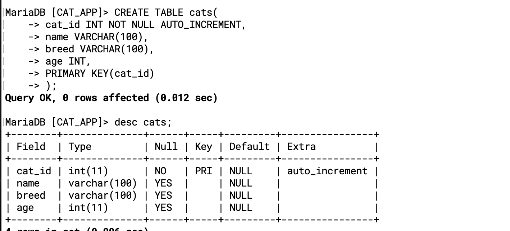
---
- insert new data
```sql
INSERT INTO cats(name, breed, age) 
VALUES ('Ringo', 'Tabby', 4),
       ('Cindy', 'Maine Coon', 10),
       ('Dumbledore', 'Maine Coon', 11),
       ('Egg', 'Persian', 4),
       ('Misty', 'Tabby', 13),
       ('George Michael', 'Ragdoll', 9),
       ('Jackson', 'Sphynx', 7);
```
---
### introduction SELECT
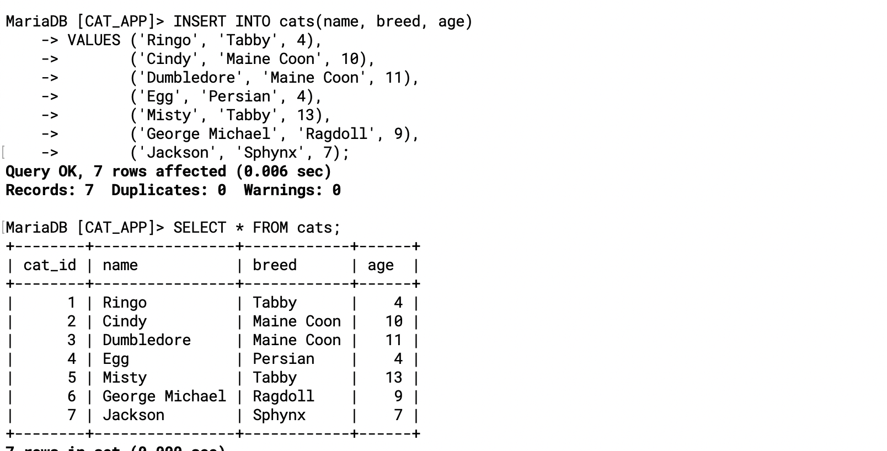
---
```sql
SELECT * FROM cats; 

SELECT name FROM cats; 

SELECT age FROM cats; 

SELECT cat_id FROM cats; 

SELECT name, age FROM cats; 

SELECT cat_id, name, age FROM cats; 

SELECT age, breed, name, cat_id FROM cats; 

SELECT cat_id, name, age, breed FROM cats; 
```
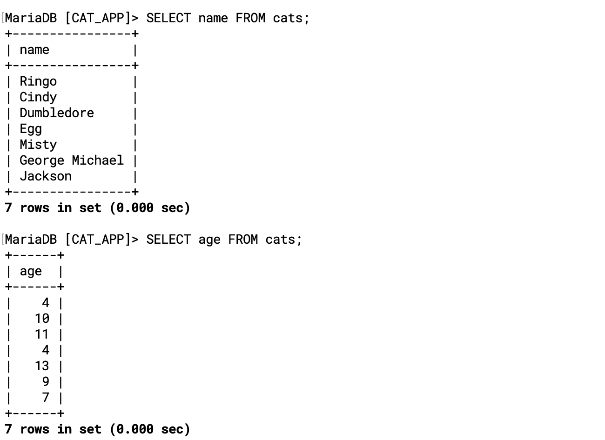
---
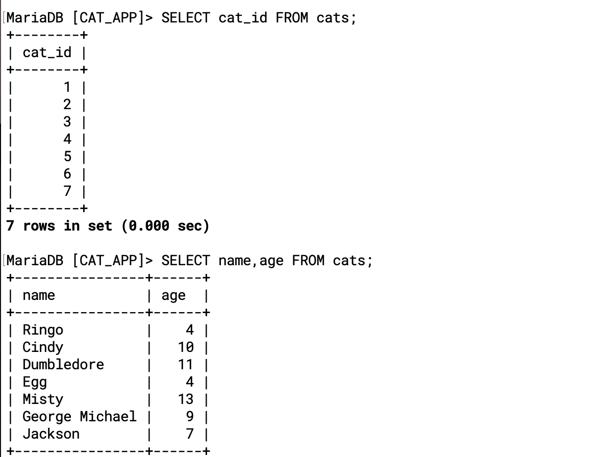
---
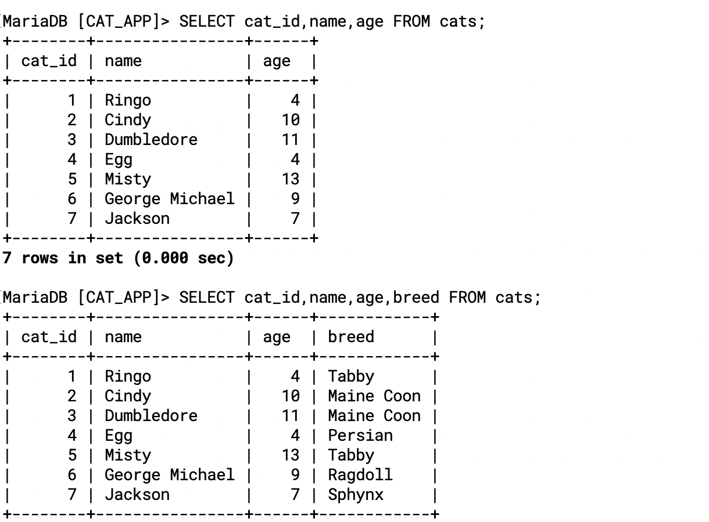
---

---
### Introduction WHERE
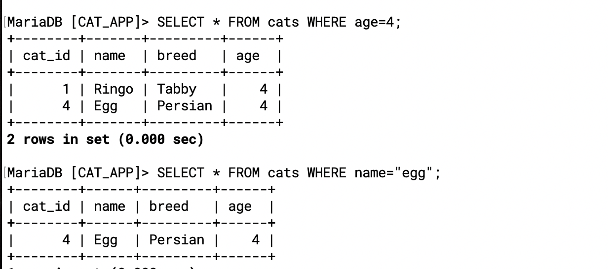
---

### SELECT Challenges
```sql
-- CODE: Select Challenges Solution
SELECT cat_id FROM cats; 

SELECT name, breed FROM cats; 

SELECT name, age FROM cats WHERE breed='Tabby'; 

SELECT cat_id, age FROM cats WHERE cat_id=age; 

SELECT * FROM cats WHERE cat_id=age; 
```

---
### Introduction to Aliases
- `SELECT cat_id AS id, name FROM cats;`
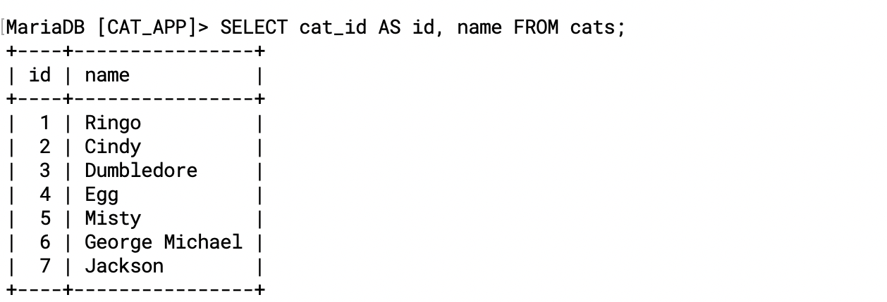
---
- `SELECT name AS 'cat name', breed AS 'kitty breed' FROM cats;`
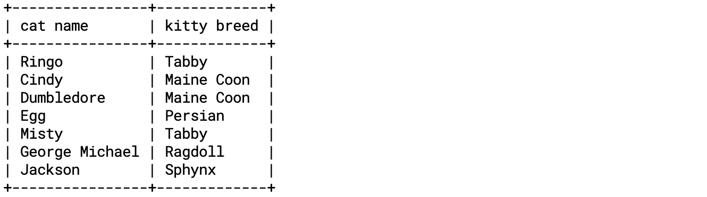
---

### Upadate 
```sql
-- Change tabby cats to shorthair:

UPDATE cats SET breed='Shorthair' WHERE breed='Tabby'; 

-- Another update:

UPDATE cats SET age=14 WHERE name='Misty'; 
```
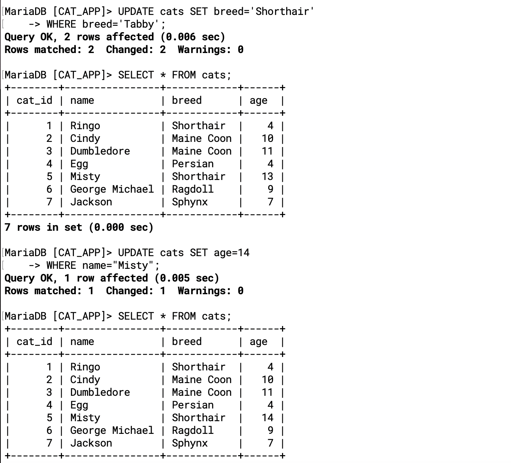
---

### Update Challenge
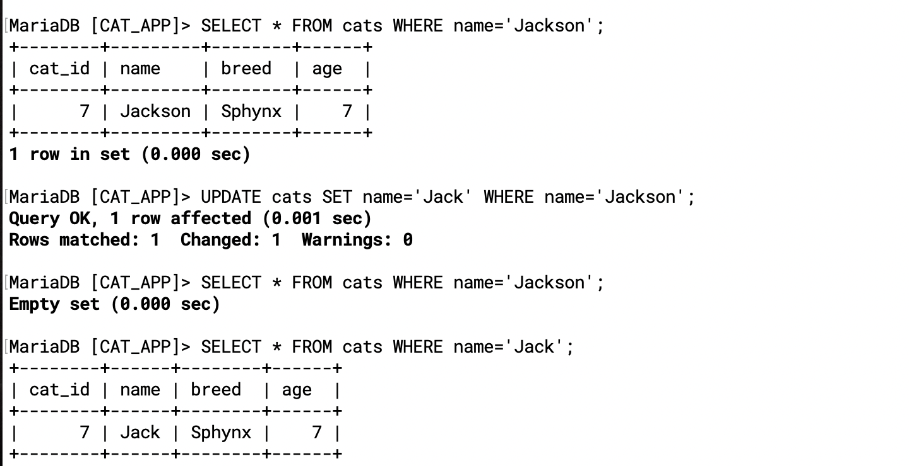
---
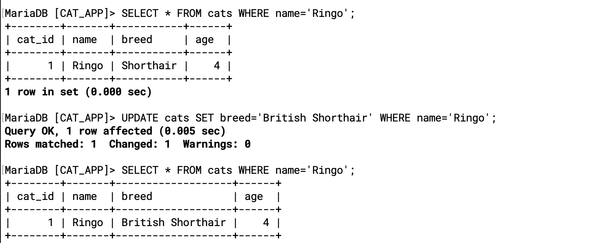
---
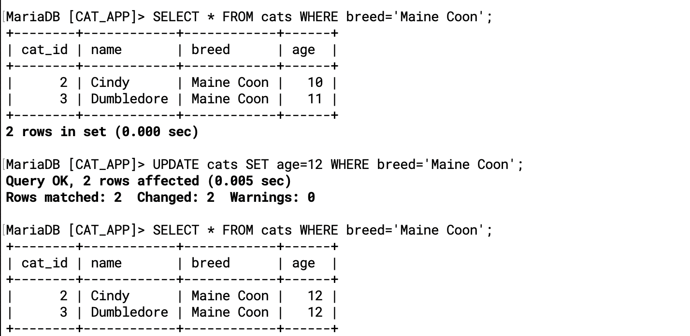
---
```sql
SELECT * FROM cats WHERE name='Jackson';
 
UPDATE cats SET name='Jack' WHERE name='Jackson';
 
SELECT * FROM cats WHERE name='Jackson';
 
SELECT * FROM cats WHERE name='Jack';
 
SELECT * FROM cats WHERE name='Ringo';
 
UPDATE cats SET breed='British Shorthair' WHERE name='Ringo';
 
SELECT * FROM cats WHERE name='Ringo';
 
SELECT * FROM cats;
 
SELECT * FROM cats WHERE breed='Maine Coon';
 
UPDATE cats SET age=12 WHERE breed='Maine Coon';
 
SELECT * FROM cats WHERE breed='Maine Coon';
```
---

### Introduction to DELETE
```sql
DELETE FROM cats WHERE name='Egg';
 
SELECT * FROM cats;
 
SELECT * FROM cats WHERE name='egg';
 
DELETE FROM cats WHERE name='egg';
 
SELECT * FROM cats;
 
DELETE FROM cats;
```
---
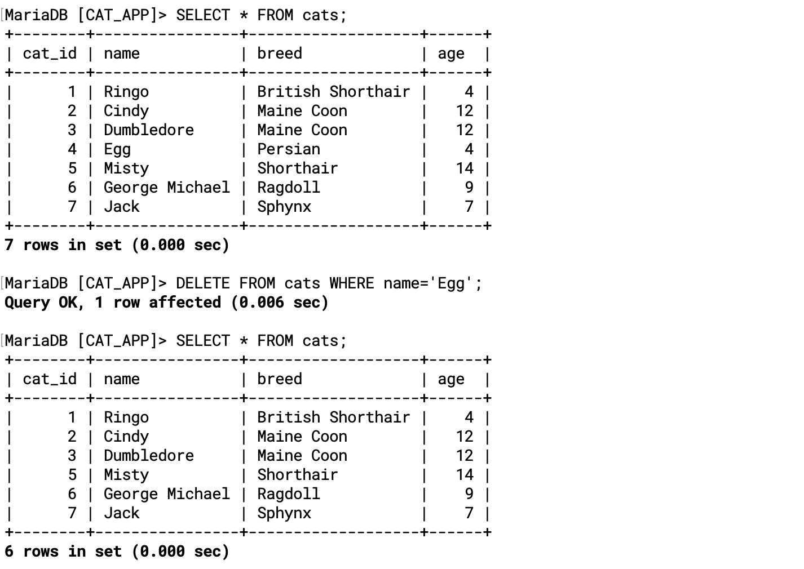
---
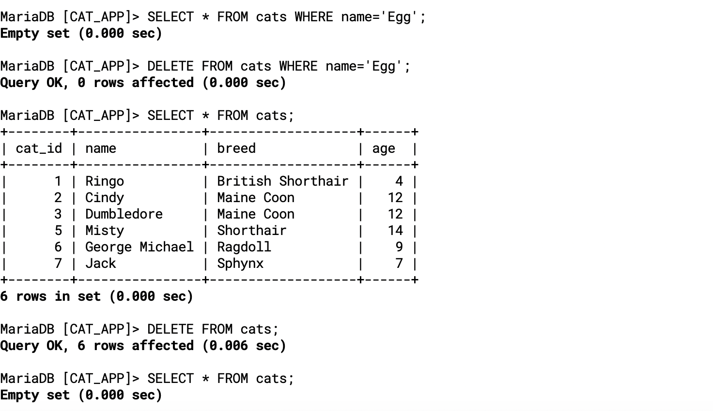
---

### DELETE Challenges
```sql
SELECT * FROM cats WHERE age=4;
 
DELETE FROM cats WHERE age=4;
 
SELECT * FROM cats WHERE age=4;
 
SELECT * FROM cats;
 
SELECT *  FROM cats WHERE cat_id=age;
 
DELETE FROM cats WHERE cat_id=age;
 
DELETE FROM cats;
 
SELECT * FROM cats;
```
---

### CRUD Challenge
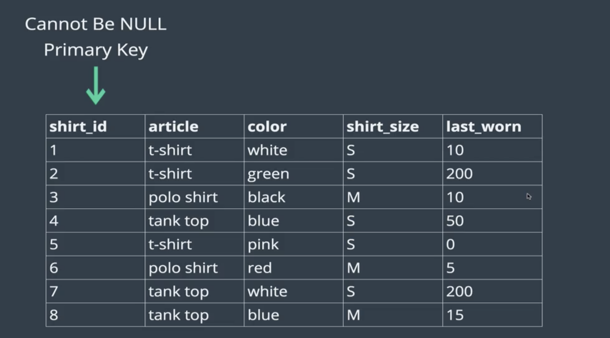
---
