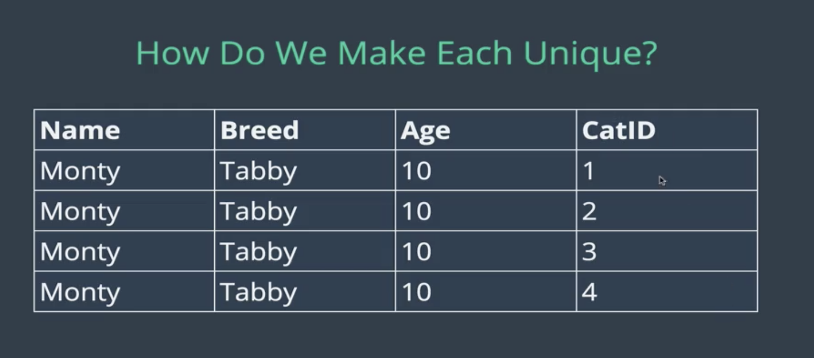
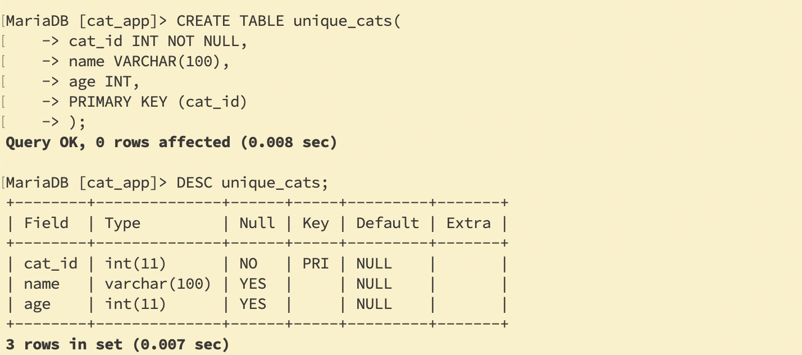
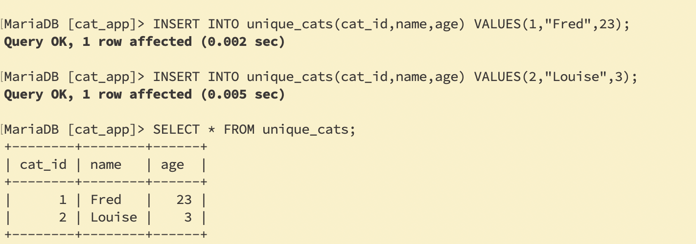
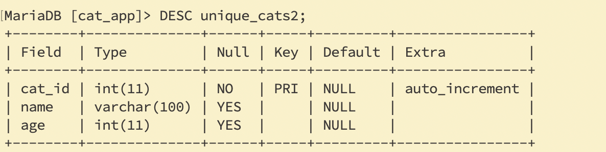
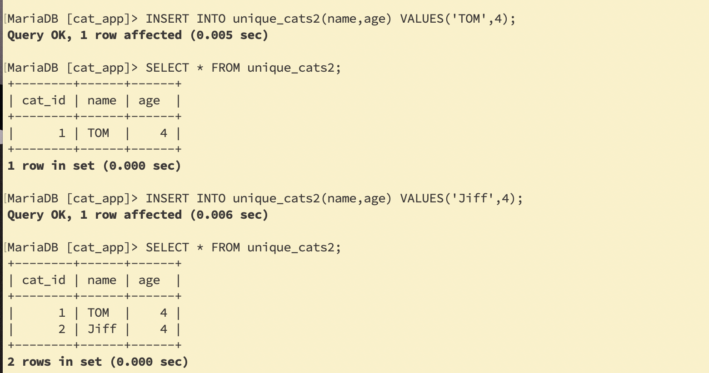
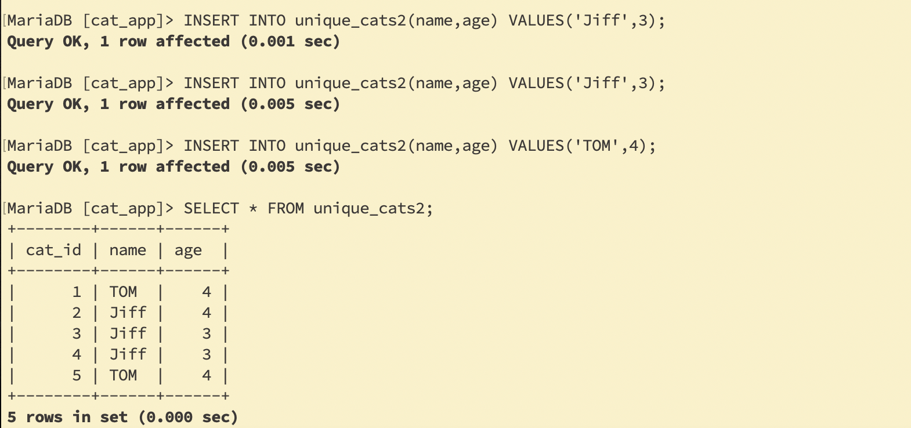
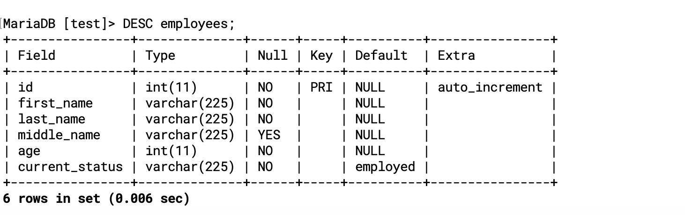
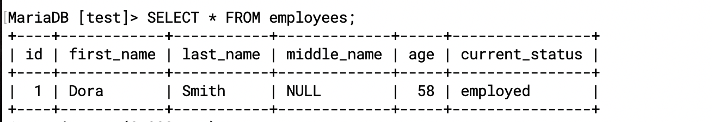

- Inserting Data

```sql
-- The "formula":

INSERT INTO table_name(column_name) VALUES (data);

-- For example:
INSERT INTO cats(name, age) VALUES ('Jetson', 7);
```

---

---
### Intro to SELECT
- `SELECT * FROM cats`

---


---
### Multiple INSERT

```sql
INSERT INTO table_name 
            (column_name, column_name) 
VALUES      (value, value), 
            (value, value), 
            (value, value);
```
---

### INSERT challenges

#### create a people table
- first_name - 20 char limit
- last_name - 20 char limit
- age

If you're wondering how to insert a string (VARCHAR) value that contains quotations, then here's how.

You can do it a couple of ways:
- Escape the quotes with a backslash: 
- `"This text has \"quotes\" in it"` or
- `'This text has \'quotes\' in it'`
---

```sql
CREATE TABLE people
  (
    first_name VARCHAR(20),
    last_name VARCHAR(20),
    age INT
  );
INSERT INTO people(first_name, last_name, age)
VALUES ('Tina', 'Belcher', 13);
INSERT INTO people(age, last_name, first_name)
VALUES (42, 'Belcher', 'Bob');
INSERT INTO people(first_name, last_name, age)
VALUES('Linda', 'Belcher', 45),
      ('Phillip', 'Frond', 38),
      ('Calvin', 'Fischoeder', 70);
```

```sql
DROP TABLE people; 

SELECT * FROM people; 

show tables; 
```

---

---

### MySQL Warnings
---

### Null Not Null

- Null means the value is not known
- Don't mean zero !

---

- this time create a table with NOT NULL

---

- CODE: NULL and NOT NULL
```sql
-- Try inserting a cat without an age:

INSERT INTO cats(name) VALUES('Alabama'); 

SELECT * FROM cats; 

-- Try inserting a nameless and ageless cat:

INSERT INTO cats() VALUES(); 


-- Define a new cats2 table with NOT NULL constraints:
```
---

### To Set Default Values

---

---

- `INSERT INTO cats3(age) VALUES(13);`

---

- we have another unnamed cat
```sql
CREATE TABLE cats3
  (
    name VARCHAR(20) DEFAULT 'no name provided',
    age INT DEFAULT 99
  );

-- Notice the change when you describe the table:

DESC cats3; 

-- Insert a cat without a name:

INSERT INTO cats3(age) VALUES(13); 

-- Or a nameless, ageless cat:

INSERT INTO cats3() VALUES(); 

-- Combine NOT NULL and DEFAULT:
CREATE TABLE cats4
  (
    name VARCHAR(20) NOT NULL DEFAULT 'unnamed',
    age INT NOT NULL DEFAULT 99
  );

-- Notice The Difference:
INSERT INTO cats() VALUES();
 
SELECT * FROM cats;
 
INSERT INTO cats3() VALUES();
 
SELECT * FROM cats3;
 
INSERT INTO cats3(name, age) VALUES('Montana', NULL);
 
SELECT * FROM cats3;
 
INSERT INTO cats4(name, age) VALUES('Cali', NULL);
```

---
### A Primer On Primary keys

---
- if we repeatly added 6 entities

---

- so how do we make each Unique?
- Primary Key, A Unique Identifier

---
- how do we know the primary key?

---
- what if we add id still equals 1?

---
- AUTO_INCREMENT
```sql
 CREATE TABLE unique_cats2( 
   cat_id INT NOT NULL AUTO_INCREMENT, 
   name VARCHAR(100), 
   age INT, 
   PRIMARY KEY (cat_id) 
  );
```

---

---

---

- source codes
```sql
-- CODE: Primary Keys
-- Define a table with a PRIMARY KEY constraint:

CREATE TABLE unique_cats
  (
    cat_id INT NOT NULL,
    name VARCHAR(100),
    age INT,
    PRIMARY KEY (cat_id)
  );
DESC unique_cats; 

-- Insert some new cats:

INSERT INTO unique_cats(cat_id, name, age) VALUES(1, 'Fred', 23);
 
INSERT INTO unique_cats(cat_id, name, age) VALUES(2, 'Louise', 3);
 
INSERT INTO unique_cats(cat_id, name, age) VALUES(1, 'James', 3);
-- Notice what happens:

SELECT * FROM unique_cats; 

-- Adding in AUTO_INCREMENT:

CREATE TABLE unique_cats2 (
    cat_id INT NOT NULL AUTO_INCREMENT,
    name VARCHAR(100),
    age INT,
    PRIMARY KEY (cat_id)
);
INSERT a couple new cats:

INSERT INTO unique_cats2(name, age) VALUES('Skippy', 4);
INSERT INTO unique_cats2(name, age) VALUES('Jiff', 3);
INSERT INTO unique_cats2(name, age) VALUES('Jiff', 3);
INSERT INTO unique_cats2(name, age) VALUES('Jiff', 3);
INSERT INTO unique_cats2(name, age) VALUES('Skippy', 4);
-- Notice the difference:

SELECT * FROM unique_cats2; 
```
---
### Table Constraints Exercise
```sql
USE test;
CREATE TABLE employees( 
    id INT AUTO_INCREMENT NOT NULL,
    first_name VARCHAR(225) NOT NULL,
    last_name VARCHAR(225) NOT NULL,
    middle_name VARCHAR(225),
    age INT NOT NULL,
    current_status VARCHAR(225) NOT NULL DEFAULT 'employed',
	PRIMARY KEY(id) 
);
```

---
- `INSERT INTO employees(first_name, last_name, age) VALUES('Dora','Smith',58);`

---
- Another way of defining a primary key:
```sql
CREATE TABLE employees (
    id INT AUTO_INCREMENT NOT NULL PRIMARY KEY,
    first_name VARCHAR(255) NOT NULL,
    last_name VARCHAR(255) NOT NULL,
    middle_name VARCHAR(255),
    age INT NOT NULL,
    current_status VARCHAR(255) NOT NULL DEFAULT 'employed'
);

-- A test INSERT:

INSERT INTO employees(first_name, last_name, age) VALUES
('Dora', 'Smith', 58);
```


