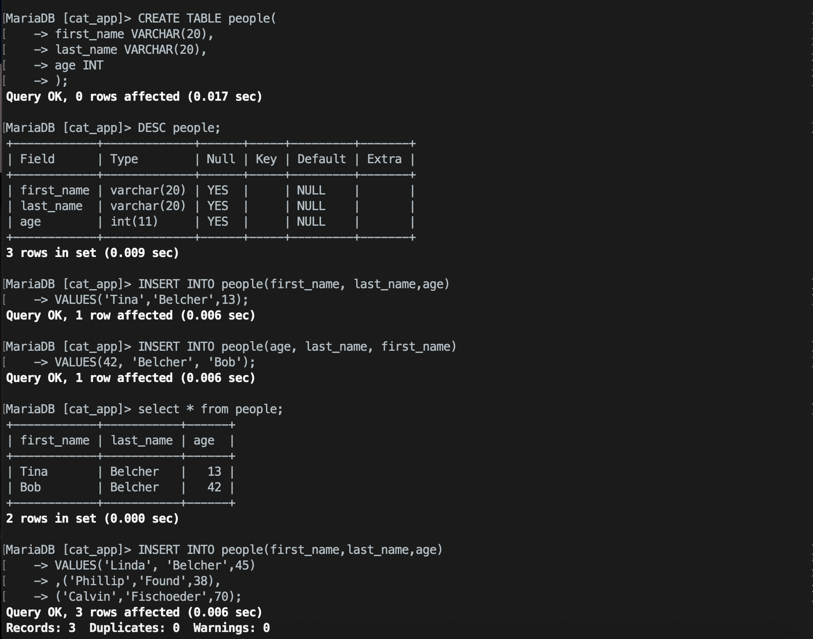
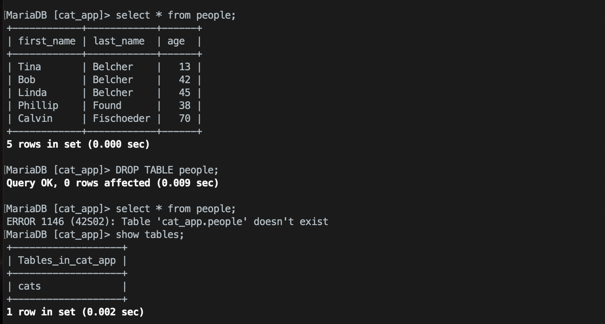
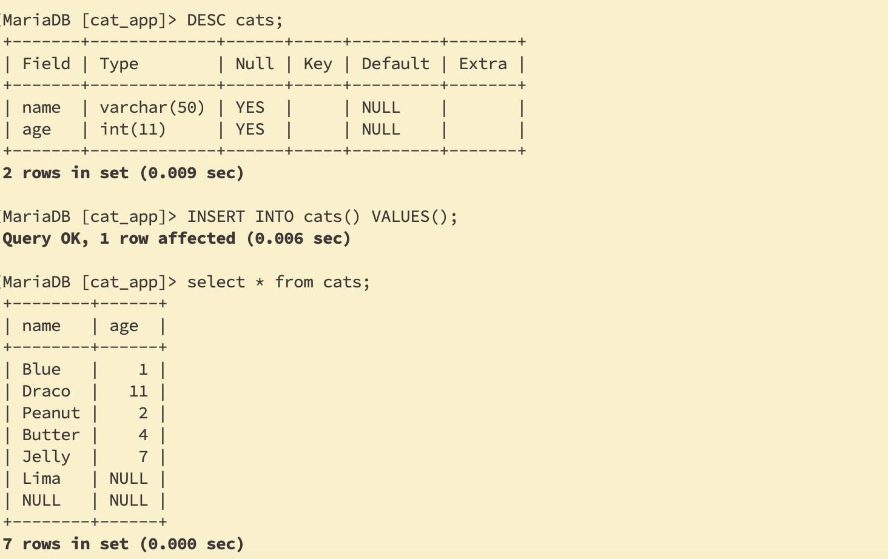
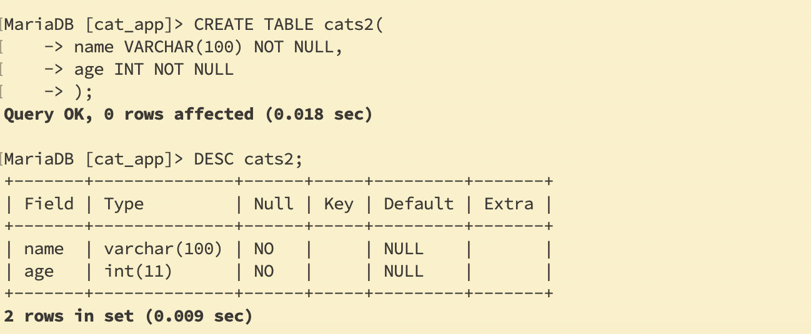
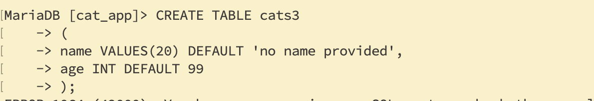
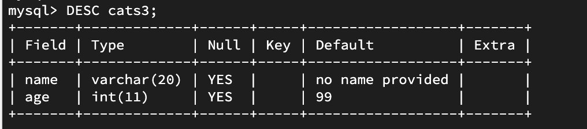
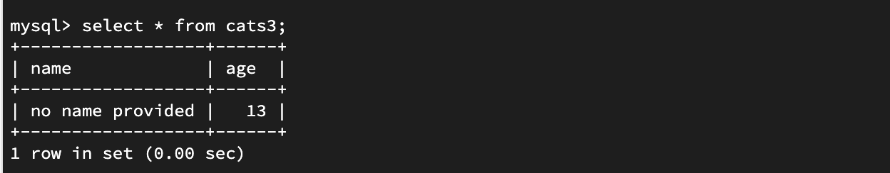
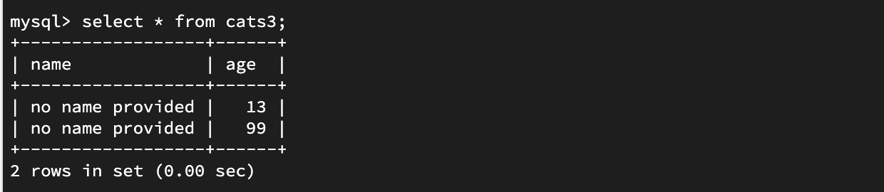

- Inserting Data

```sql
-- The "formula":

INSERT INTO table_name(column_name) VALUES (data);

-- For example:
INSERT INTO cats(name, age) VALUES ('Jetson', 7);
```

---

---
### Intro to SELECT
- `SELECT * FROM cats`

---


---
### Multiple INSERT

```sql
INSERT INTO table_name 
            (column_name, column_name) 
VALUES      (value, value), 
            (value, value), 
            (value, value);
```
---

### INSERT challenges

#### create a people table
- first_name - 20 char limit
- last_name - 20 char limit
- age

If you're wondering how to insert a string (VARCHAR) value that contains quotations, then here's how.

You can do it a couple of ways:
- Escape the quotes with a backslash: 
- `"This text has \"quotes\" in it"` or
- `'This text has \'quotes\' in it'`
---

```sql
CREATE TABLE people
  (
    first_name VARCHAR(20),
    last_name VARCHAR(20),
    age INT
  );
INSERT INTO people(first_name, last_name, age)
VALUES ('Tina', 'Belcher', 13);
INSERT INTO people(age, last_name, first_name)
VALUES (42, 'Belcher', 'Bob');
INSERT INTO people(first_name, last_name, age)
VALUES('Linda', 'Belcher', 45),
      ('Phillip', 'Frond', 38),
      ('Calvin', 'Fischoeder', 70);
```

```sql
DROP TABLE people; 

SELECT * FROM people; 

show tables; 
```

---

---

### MySQL Warnings
---

### Null Not Null

- Null means the value is not known
- Don't mean zero !

---

- this time create a table with NOT NULL

---

- CODE: NULL and NOT NULL
```sql
-- Try inserting a cat without an age:

INSERT INTO cats(name) VALUES('Alabama'); 

SELECT * FROM cats; 

-- Try inserting a nameless and ageless cat:

INSERT INTO cats() VALUES(); 


-- Define a new cats2 table with NOT NULL constraints:
```
---

### To Set Default Values

---

---

- `INSERT INTO cats3(age) VALUES(13);`

---

- we have another unnamed cat
