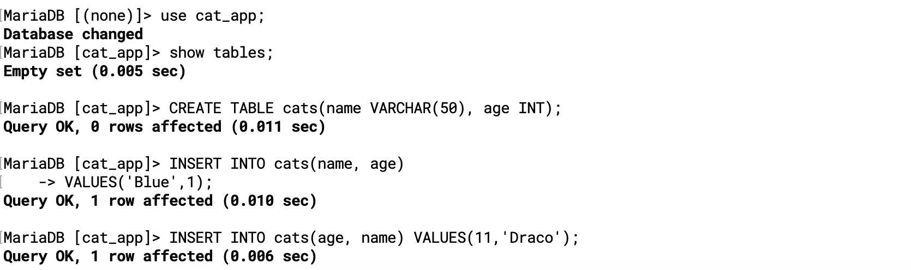
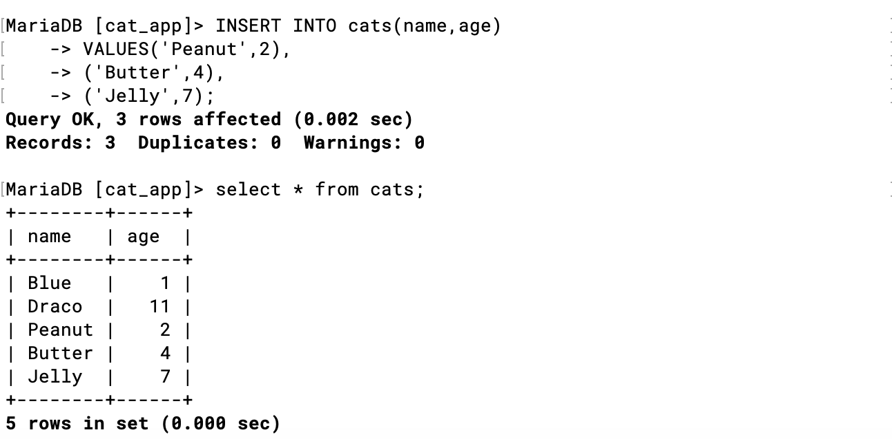

- Inserting Data

```sql
-- The "formula":

INSERT INTO table_name(column_name) VALUES (data);

-- For example:
INSERT INTO cats(name, age) VALUES ('Jetson', 7);
```

---

---
### Intro to SELECT
- `SELECT * FROM cats`

---


---
### Multiple INSERT

```sql
INSERT INTO table_name 
            (column_name, column_name) 
VALUES      (value, value), 
            (value, value), 
            (value, value);
```
---

### INSERT challenges

#### create a people table
- first_name - 20 char limit
- last_name - 20 char limit
- age

If you're wondering how to insert a string (VARCHAR) value that contains quotations, then here's how.

You can do it a couple of ways:
- Escape the quotes with a backslash: 
- `"This text has \"quotes\" in it"` or
- `'This text has \'quotes\' in it'`

