# SQL

- `goorm.io`
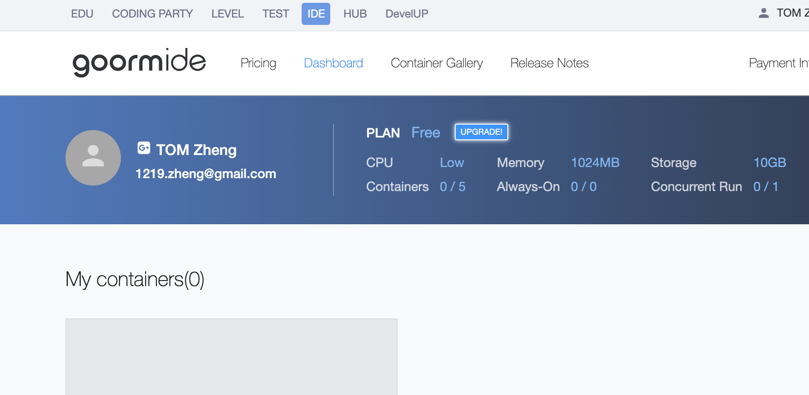
---
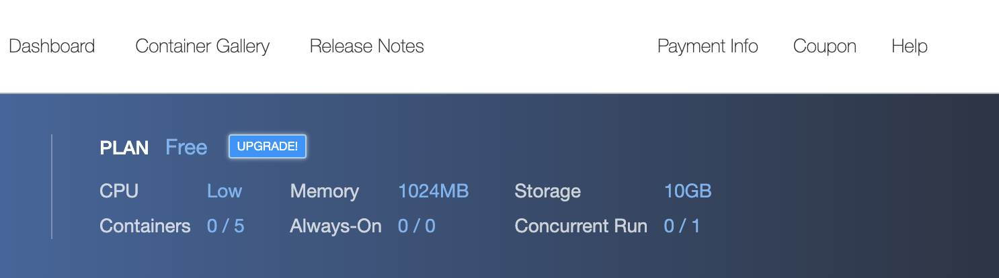
- click `Coupon`
- code `cfWQaYAAlkSh`
---
- now we will create a online database
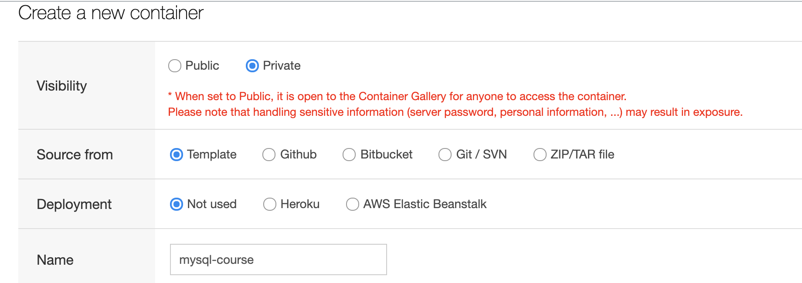
---
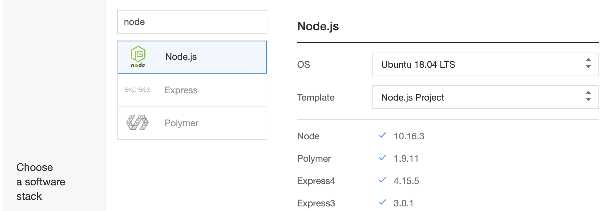
---
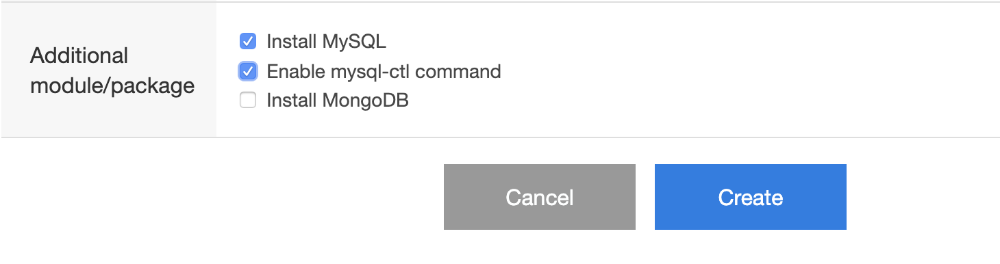
---
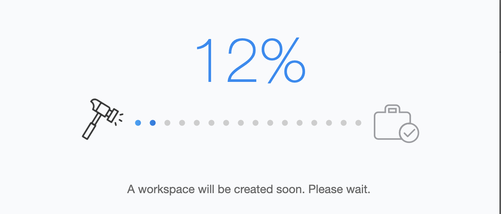
---

- now we see the Dashboard
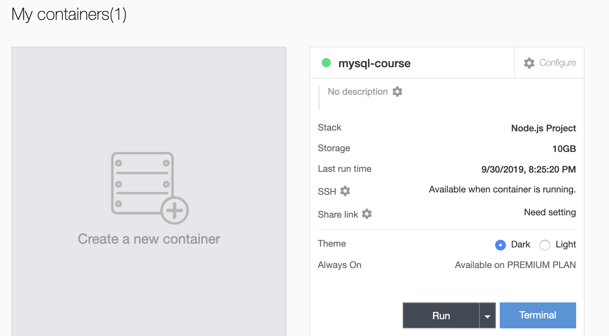
- click RUN button

- now we have two ways to switch dark to light:
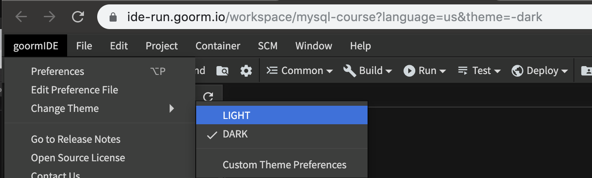
---
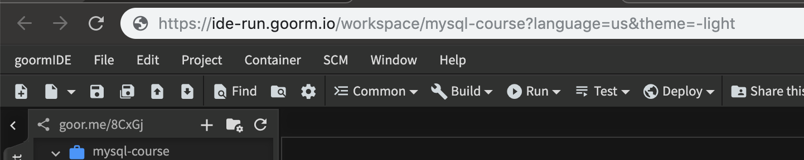
---
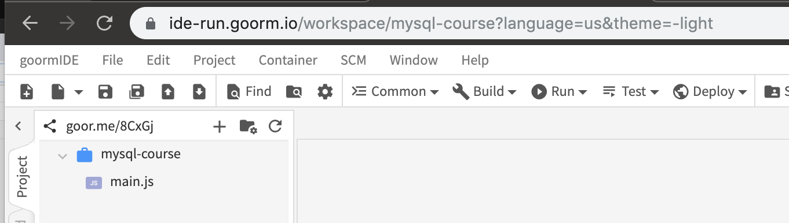
---

---
- try to start mysql server and stop mysql server
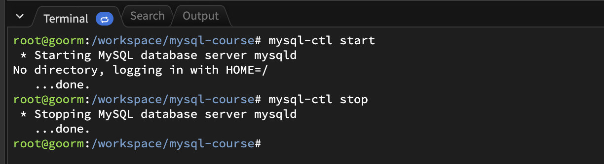
---
- now try to connect to database
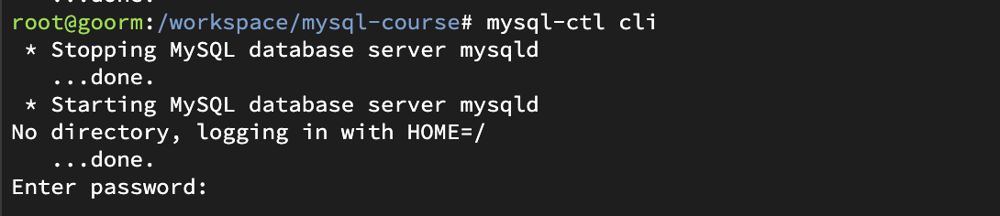
---
- enter space
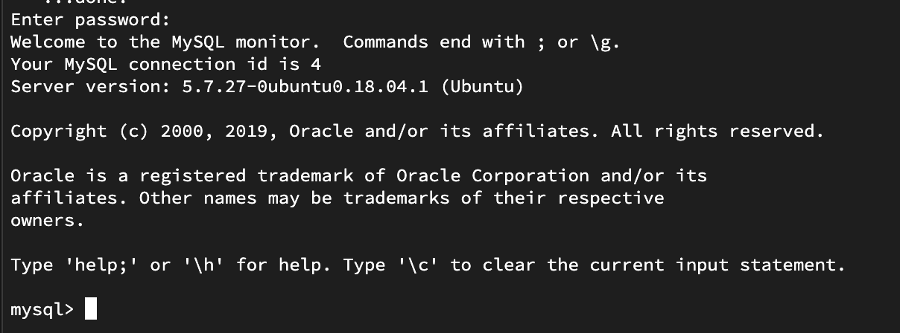

