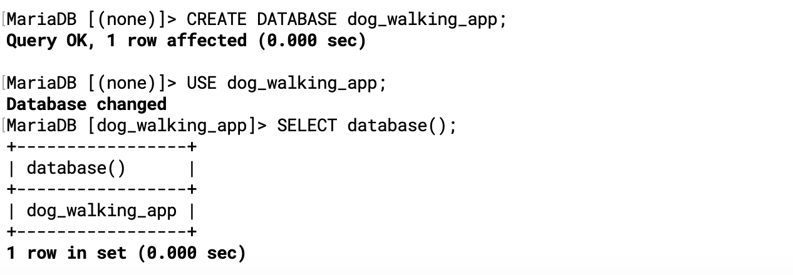
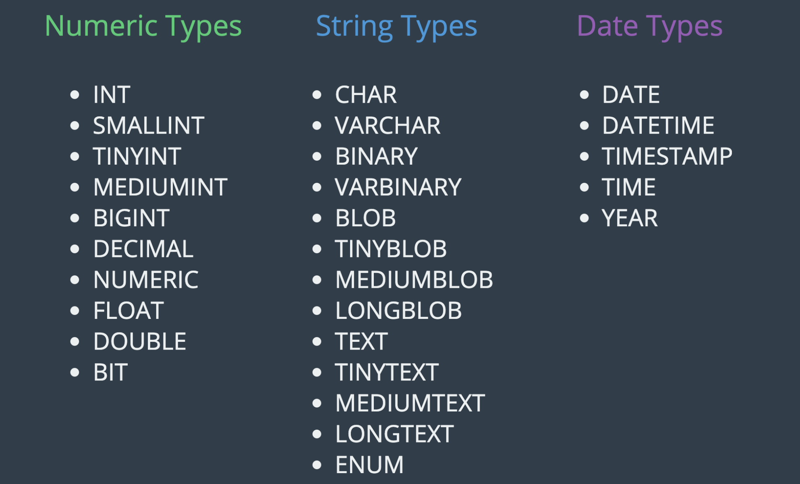

### creating databases

- List available databases:
- `show databases; `
- The general command for creating a database:
- `CREATE DATABASE database_name; `
- A specific example:
- `CREATE DATABASE soap_store; `

---
### Dropping Data

- `DROP DATABASE testing_db;`

---

### using Databases

- if we wanted to know for sure what database we are currently using
- `SELECT database();`

---

---

---
### The Basic Datatypes

---

