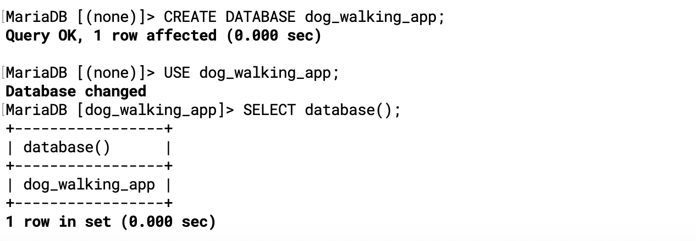
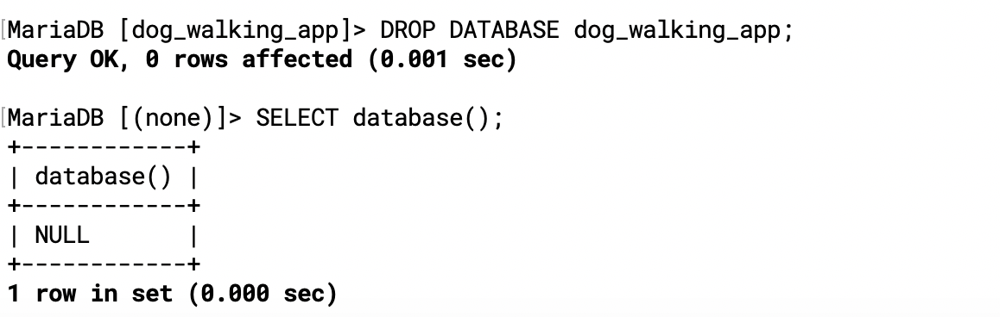
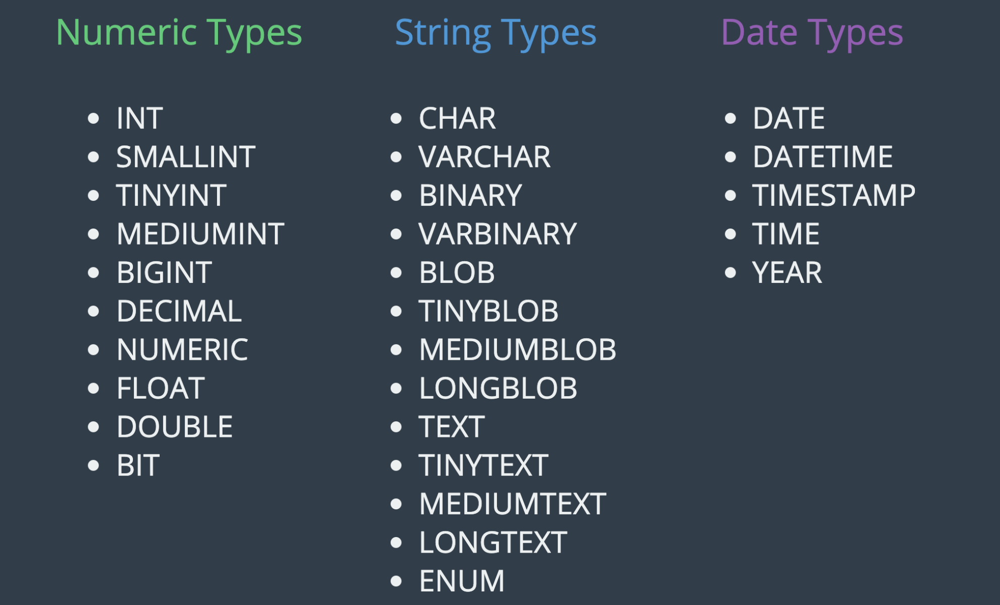
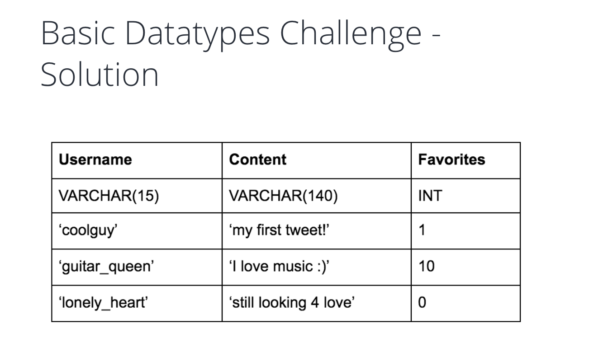
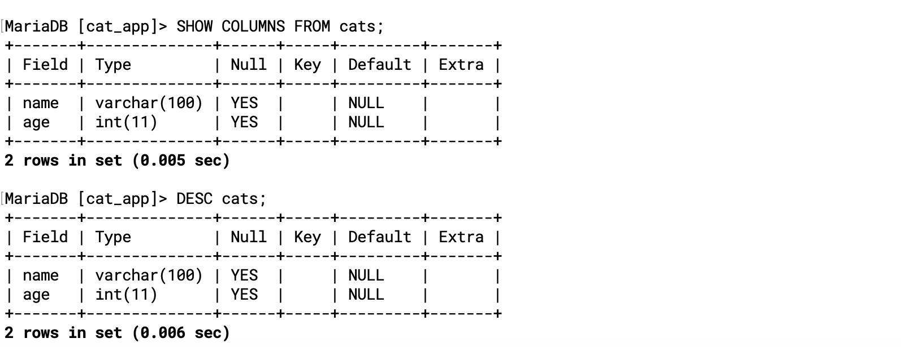
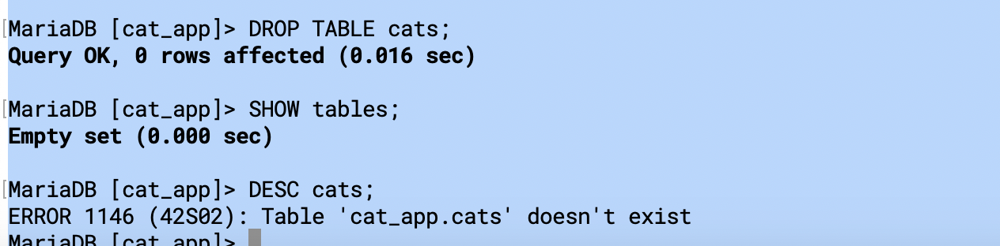
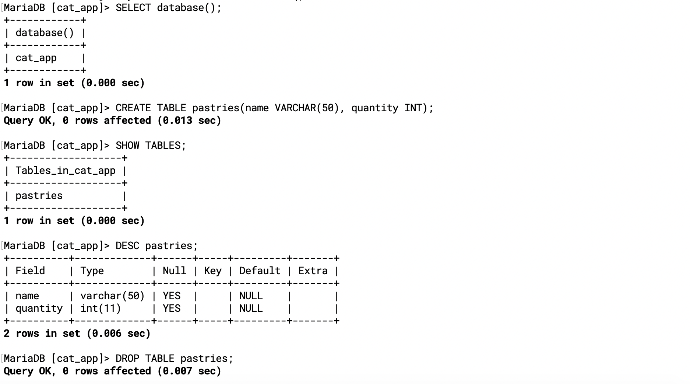

## Create/Drop Database/Table

### creating databases

- List available databases:
- `show databases; `
- The general command for creating a database:
- `CREATE DATABASE database_name; `
- A specific example:
- `CREATE DATABASE soap_store; `

---
### Dropping Data

- `DROP DATABASE testing_db;`

---

### using Databases

- if we wanted to know for sure what database we are currently using

- `SELECT database();`




---



---

### The Basic Datatypes



---



---

```sql
CREATE TABLE tablename
  (
    column_name data_type,
    column_name data_type
  );
CREATE TABLE cats
  (
    name VARCHAR(100),
    age INT
  );
```

---

```sql
SHOW TABLES;
 
SHOW COLUMNS FROM tablename;
 
DESC tablename;
```



---


### Dropping tables

```sql
-- Dropping Tables
DROP TABLE <tablename>; 

-- A specific example:

DROP TABLE cats; 
```



---

- Creating tables

```sql
CREATE TABLE pastries
  (
    name VARCHAR(50),
    quantity INT
  );
 
SHOW TABLES;
 
DESC pastries;
 
DROP TABLE pastries;
```



