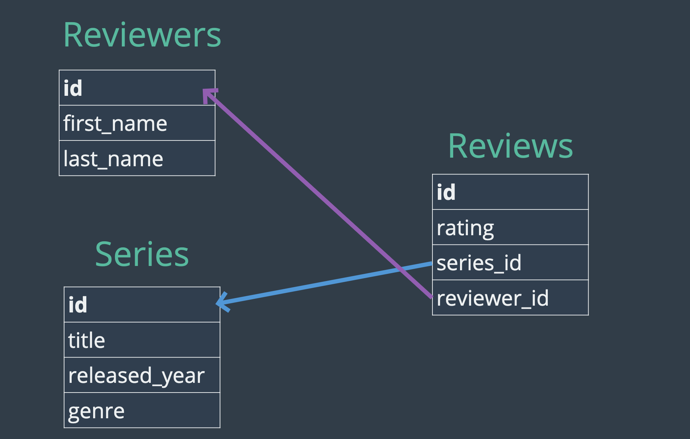

### Many to Many


---


### Create tables

```sql

CREATE DATABASE tv_review_app;

-- CREATING THE REVIEWERS TABLE


CREATE TABLE reviewers (
    id INT AUTO_INCREMENT PRIMARY KEY,
    first_name VARCHAR(100),
    last_name VARCHAR(100)
);
-- CREATING THE SERIES TABLE

CREATE TABLE series(
    id INT AUTO_INCREMENT PRIMARY KEY,
    title VARCHAR(100),
    released_year YEAR(4),
    genre VARCHAR(100)
);
-- CREATING THE REVIEWS TABLE
-- this is a relationship table
CREATE TABLE reviews (
    id INT AUTO_INCREMENT PRIMARY KEY,
    rating DECIMAL(2,1),
    series_id INT,
    reviewer_id INT,
    FOREIGN KEY(series_id) REFERENCES series(id),
    FOREIGN KEY(reviewer_id) REFERENCES reviewers(id)
);
-- INSERTING A BUNCH OF DATA

INSERT INTO series (title, released_year, genre) VALUES
    ('Archer', 2009, 'Animation'),
    ('Arrested Development', 2003, 'Comedy'),
    ("Bob's Burgers", 2011, 'Animation'),
    ('Bojack Horseman', 2014, 'Animation'),
    ("Breaking Bad", 2008, 'Drama'),
    ('Curb Your Enthusiasm', 2000, 'Comedy'),
    ("Fargo", 2014, 'Drama'),
    ('Freaks and Geeks', 1999, 'Comedy'),
    ('General Hospital', 1963, 'Drama'),
    ('Halt and Catch Fire', 2014, 'Drama'),
    ('Malcolm In The Middle', 2000, 'Comedy'),
    ('Pushing Daisies', 2007, 'Comedy'),
    ('Seinfeld', 1989, 'Comedy'),
    ('Stranger Things', 2016, 'Drama');
 
 
INSERT INTO reviewers (first_name, last_name) VALUES
    ('Thomas', 'Stoneman'),
    ('Wyatt', 'Skaggs'),
    ('Kimbra', 'Masters'),
    ('Domingo', 'Cortes'),
    ('Colt', 'Steele'),
    ('Pinkie', 'Petit'),
    ('Marlon', 'Crafford');
    
 
INSERT INTO reviews(series_id, reviewer_id, rating) VALUES
    (1,1,8.0),(1,2,7.5),(1,3,8.5),(1,4,7.7),(1,5,8.9),
    (2,1,8.1),(2,4,6.0),(2,3,8.0),(2,6,8.4),(2,5,9.9),
    (3,1,7.0),(3,6,7.5),(3,4,8.0),(3,3,7.1),(3,5,8.0),
    (4,1,7.5),(4,3,7.8),(4,4,8.3),(4,2,7.6),(4,5,8.5),
    (5,1,9.5),(5,3,9.0),(5,4,9.1),(5,2,9.3),(5,5,9.9),
    (6,2,6.5),(6,3,7.8),(6,4,8.8),(6,2,8.4),(6,5,9.1),
    (7,2,9.1),(7,5,9.7),
    (8,4,8.5),(8,2,7.8),(8,6,8.8),(8,5,9.3),
    (9,2,5.5),(9,3,6.8),(9,4,5.8),(9,6,4.3),(9,5,4.5),
    (10,5,9.9),
    (13,3,8.0),(13,4,7.2),
    (14,2,8.5),(14,3,8.9),(14,4,8.9);
```

---

###  TV joins CHALLENGE 1

```sql
SELECT 
    title, 
    rating 
FROM series
JOIN reviews
    ON series.id = reviews.series_id;
```

---

### 2nd Example:

- A **many-to-many** relationship in a relational database means that multiple records in one table 
  can be related to multiple records in another table, and vice versa. 
  This type of relationship is typically implemented using a junction table (also known as a bridge table, join table, or associative entity) that breaks down the many-to-many relationship into two one-to-many relationships.


- Example:
  - Consider an example involving two tables: `students` and `courses`. A student can enroll in multiple `courses`, and a course can have multiple students enrolled. This is a classic **many-to-many** relationship.
  

```sql
CREATE TABLE students (
    student_id INT PRIMARY KEY,
    student_name VARCHAR(100)
    -- Other columns
);

CREATE TABLE courses (
    course_id INT PRIMARY KEY,
    course_name VARCHAR(100)
    -- Other columns
);

CREATE TABLE enrollments (
    enrollment_id INT PRIMARY KEY AUTO_INCREMENT,
    student_id INT,
    course_id INT,
    FOREIGN KEY (student_id) REFERENCES students(student_id),
    FOREIGN KEY (course_id) REFERENCES courses(course_id)
);


### Example Data

INSERT INTO students (student_id, student_name) VALUES (1, 'Alice'), (2, 'Bob');
INSERT INTO courses (course_id, course_name) VALUES (1, 'Math'), (2, 'Science');

INSERT INTO enrollments (student_id, course_id) VALUES (1, 1), (1, 2), (2, 1);
```

- Student **Alice**(student_id = 1) is enrolled in both **Math** (course_id = 1) and **Science** (course_id = 2).
- Student **Bob** (student_id = 2) is enrolled in **Math** (course_id = 1).