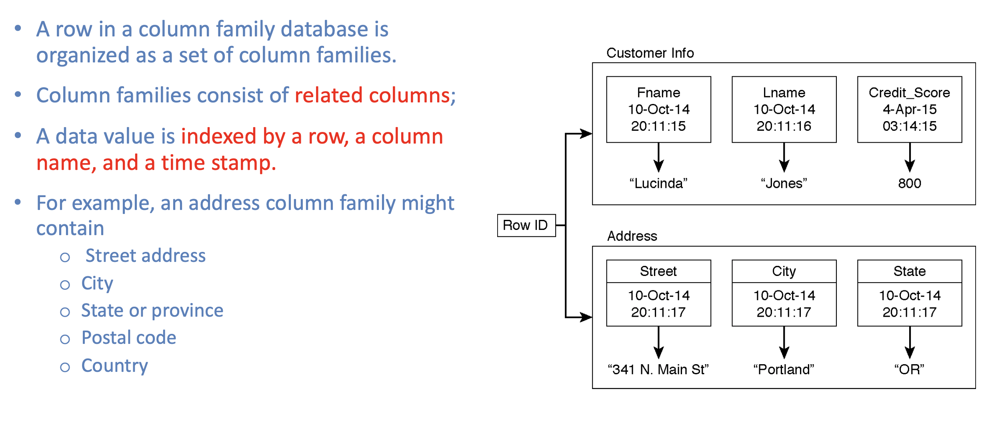

## Core Features of Google BigTable

- Developers have dynamic control over columns.
- Data values are indexed by row identifier, column name, and a time
  stamp.
- Data modelers and developers have control over location of data
- Reads and writes of a row are atomic
- Rows are maintained in a sorted order

---

