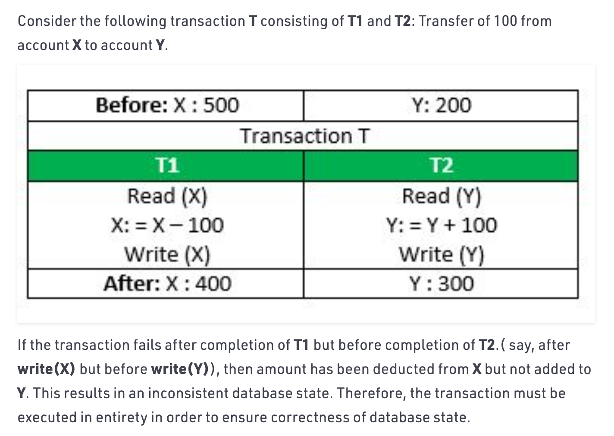

## Interview Question

1. Does NoSQL use tables?

- Relational databases rely on tables, columns, rows, or schemas to organize and retrieve data
- <u>NoSQL databases do not rely on these structures and use more flexible data models.</u>

---

2. Does NoSQL have JOIN?

- Document-oriented databases such as `MongoDB` are designed to store denormalized data. Ideally, 
  there should be no relationship between collections. If the same data is required in two or more 
  documents, it must be repeated.

-----

## Transaction ACID Properties

- Atomicity 
  - Transaction cannot be subdivided

- Consistency  
  - Constraints don’t change from before transaction to after transaction

- Isolation   n. 隔离；孤立
  - Database changes not revealed to users until after transaction has completed

- Durability  n. 耐久性；坚固；
  - Database changes are permanent

-----

## Issue with RDBMS - Distributable

- Relational databases were not built for distributed applications. Because
  - Joins are expensive
  - Hard to scale horizontally

---

## What is NoSQL?

- NoSQL is an umbrella term(涵盖性术语) for all databases and data stores that don’t 
  follow the RDBMS principles
  - A collection of several (related) concepts about data storage and manipulation 
  - Often related to large data sets
- non-relational data storage systems
- do not require a fixed table schema
- All NoSQL offerings relax one or more of the ACID properties (Atomicity, Consistency, Isolation,  
  Durability) using CAP theorem
- Open-source community  

---

### NoSQL Definition

- being non-relational, distributed分布式的，open-source, horizontal scalable
- schema-free, easy replication(复制；回答) support, simple API, eventually consistent / BASE 
  (not ACID), a huge data amount, and more.

---

## Where does NoSQL come from?

---

### Why are RDBMS not suitable for Big Data?

- The context is Internet
- RDBMSs assume that data are
  - dense  [dens 稠密的
  - structured data 结构化资料

- Data coming from Internet are     
  - Massive [ˈmæsɪv] and sparse  [spɑːrs] 庞大而稀疏

