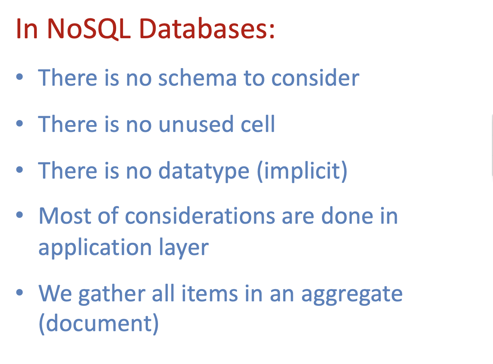

## NoSQL Data Model and Development

- Hash tables of Keys
- Values stored with keys
- Fast access to small data values

---

### Map Reduce

- `map(key, val)` is run on each item in set

- `reduce(key, vals)` is run for each unique key emitted by map()

---

## NoSQL Why? What? And When?

---

## What is a Schema-less Data Model?

---

