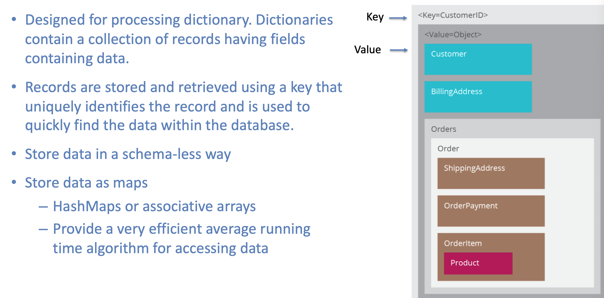

## NoSQL Database Types

- Sorted ordered Column Store
- Key-Value Store
- Document databases
- Graph Databases

---

###  Sorted Ordered/Wide Column Based

- Avoids consuming space for storing nulls
- Columns are grouped in column-families
- Data isn’t stored as a single table but is stored by column families
- Unit of data is a set of key/value pairs
  - Identified by “row-key”
  - Ordered and sorted based on row-key

---

- Column Family Notable Examples:
  - Google's Bigtable (used in all Google's services),
  - HBase (Facebook, StumbleUpon, Hulu, Yahoo!, ...),
  - Cassandra (Reddit, Twitter,...)
  - Hypertable, and
  - Amazon DynamoDB. (a key-value and document-oriented store)

- We use it for content management systems, blogging platforms, log aggregation.
- We would avoid for systems that are in early development, changing query patterns.

---

###  Key-Value Pair Based

-----

## NoSQL uses CAP Theorem

- 3 properties:
  - Consistency
  - Availability
  - Partitions 分开

- Everyone who builds big applications builds them on CAP : Google, Yahoo, Facebook, Amazon, eBay, etc.

