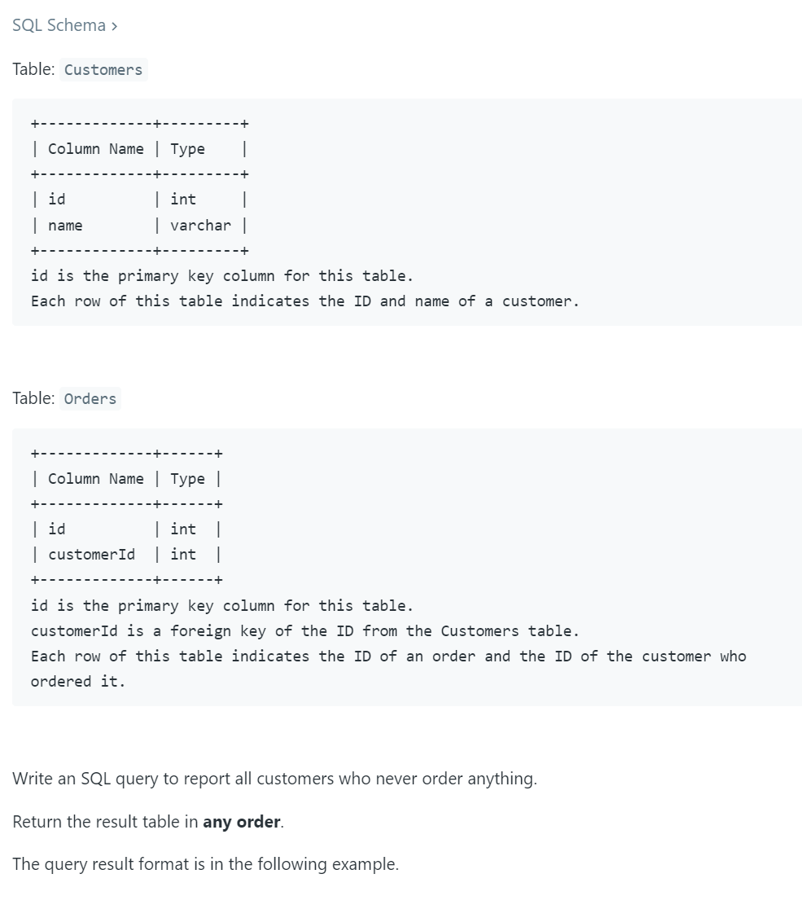
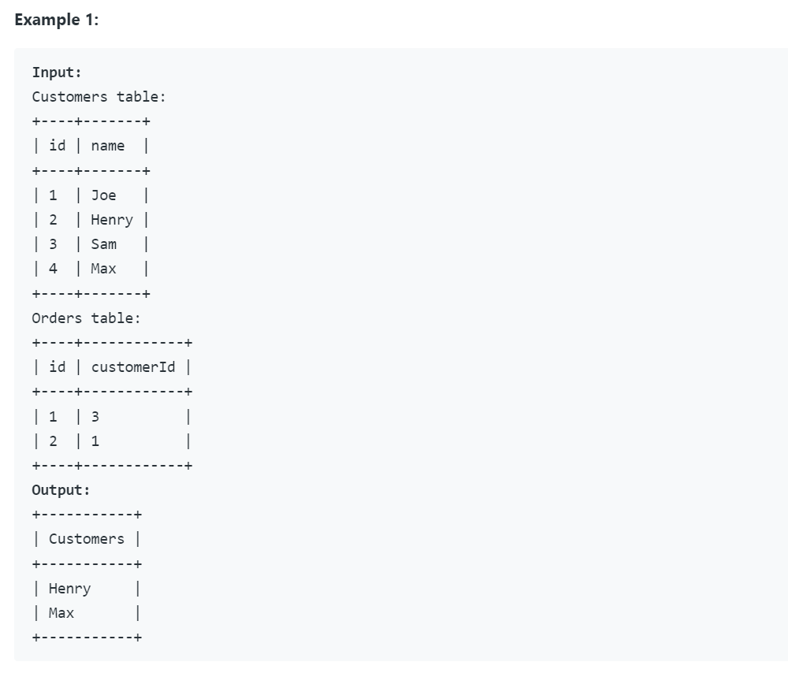
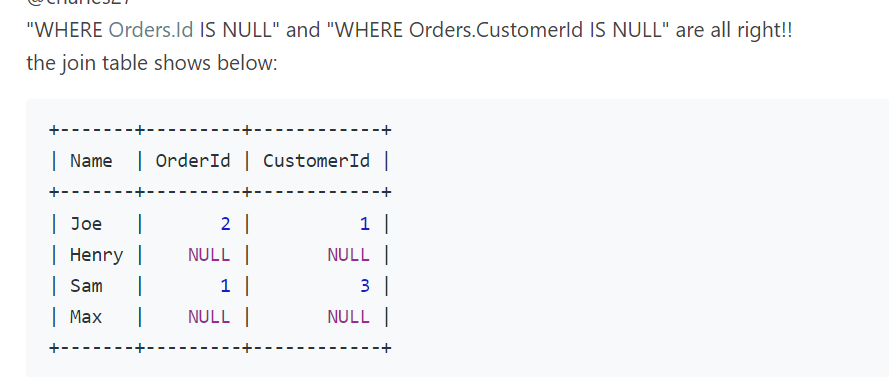

## 183. Customers Who Never Order




- [AS keyword](https://www.w3schools.com/sql/sql_ref_as.asp)

```sql
SELECT name AS Customers 
FROM Customers
WHERE id NOT IN (
    SELECT CustomerId 
    FROM Orders
);
```

---

### 2nd way

- [Left join](https://www.w3schools.com/sql/sql_join_left.asp)


- When the joint result shows Null, it means this customer doesn't place any order, so it could be an identifier to be filtered.

```sql
SELECT name AS Customers 
FROM Customers
LEFT JOIN Orders
ON Customers.id = Orders.customerId
WHERE Orders.customerId is NULL
```
