---

### One To Many

- A customer's first and last name
- A customer's email
- The date of the purchase
- The price of the order

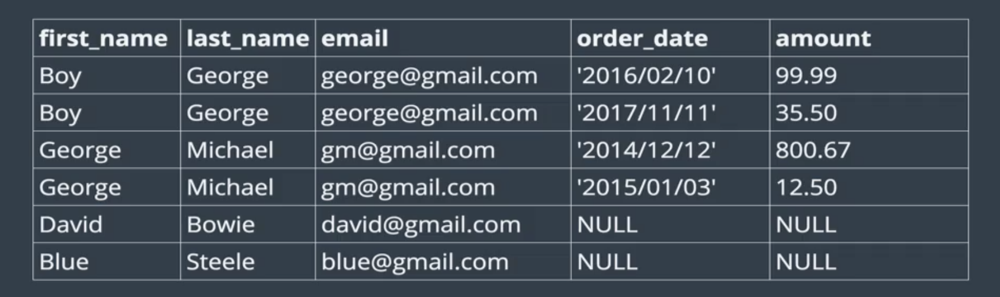
---

- it's much better to keep our data separated because if we ever need to work with just customers on, you don't care about order, you just care about custmoer
- this is a bad idea
---

- this is a good idea
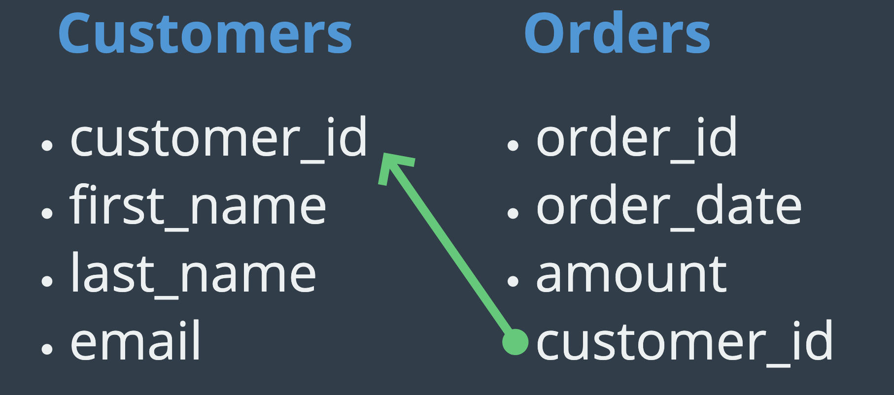
---
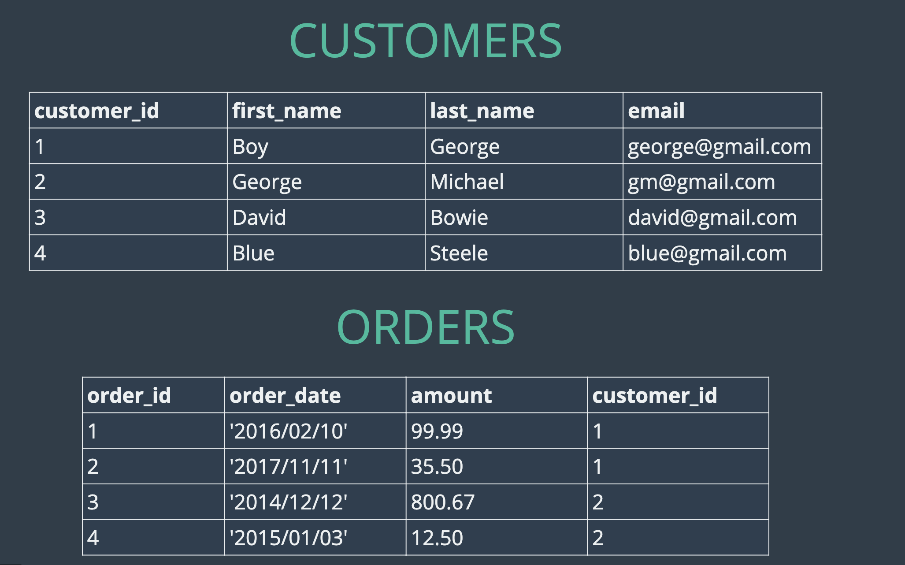
---
- primary key
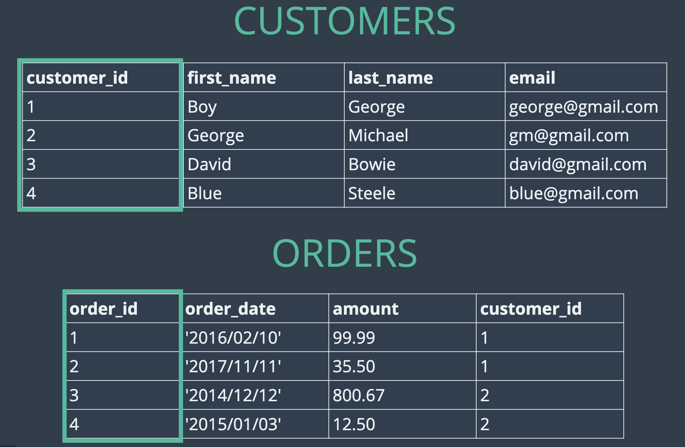
---
- Foreign key
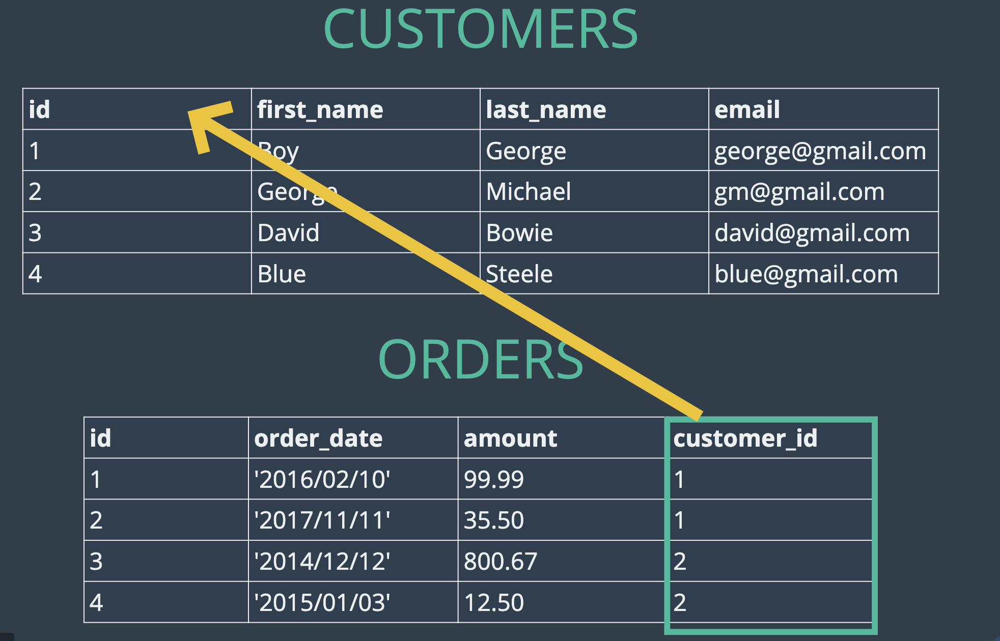
---

### working with Foreign keys
- create a table

---
```sql
 CREATE TABLE customers(
    id INT AUTO_INCREMENT PRIMARY KEY,
	first_name VARCHAR(100),
    last_name VARCHAR(100),
    email VARCHAR(100) 
 );

CREATE TABLE orders(
    id INT AUTO_INCREMENT PRIMARY KEY,
     order_date DATE,
     amount DECIMAL(8,2),
     customer_id INT 
);

INSERT INTO customers(first_name,last_name,email)
VALUES('Boy','George','george@gmail.com'),
		('George','Michael','gm@gmail.com'),
		('David','Bowie','David@gmail.com'),
		('Blue','Steele','blue@gmail.com'),
		('Bette','Dvids','bette@gmail.com');


INSERT INTO orders(order_date,amount,customer_id)
VALUES('2016/02/10',99.99,1),
('2017/11/11',35.99,1),
('2014/12/10',800.99,2),
('2015/01/03',12.59,2),
('1999/02/10',450.25,5);
```
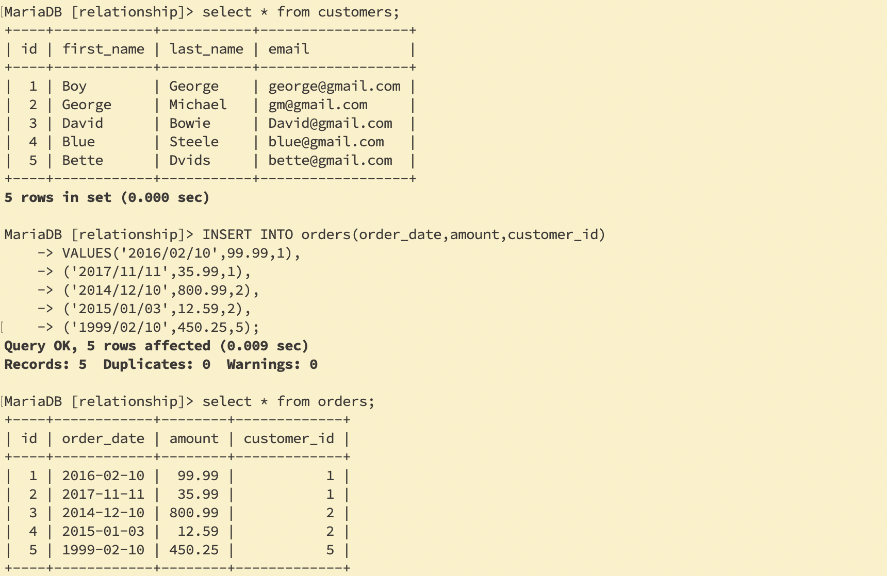
---
- if we insert a customers id 98, but you see there is no relationship
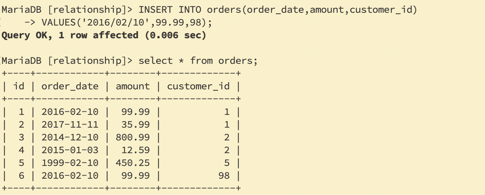
---
- thus, we need to use foreign key
- we drop customers orders table first
`MariaDB [relationship]> DROP TABLE customers,orders;`
- we rebuild new tables
```sql
 CREATE TABLE customers(
    id INT AUTO_INCREMENT PRIMARY KEY,
	first_name VARCHAR(100),
    last_name VARCHAR(100),
    email VARCHAR(100) 
 );

 CREATE TABLE orders(
    id INT AUTO_INCREMENT PRIMARY KEY,
     order_date DATE,
     amount DECIMAL(8,2),
     customer_id INT,
	FOREIGN KEY(customer_id) REFERENCES customers(id) 
);
```
- insert data again
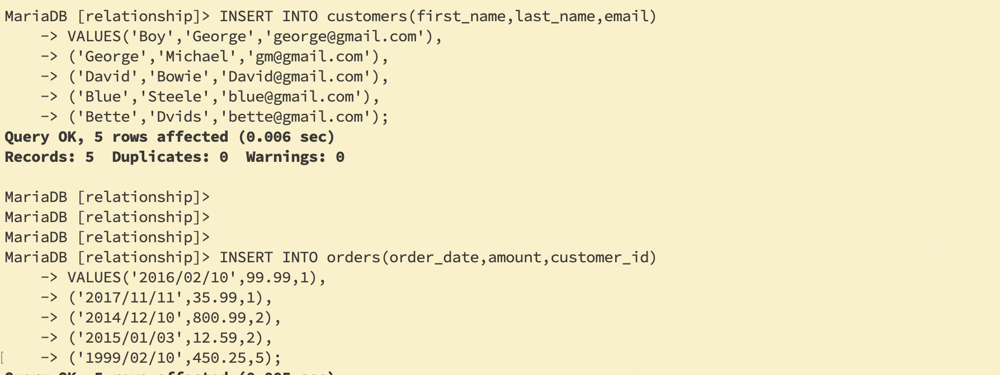
---
- if we want to insert id = 98, what happen?
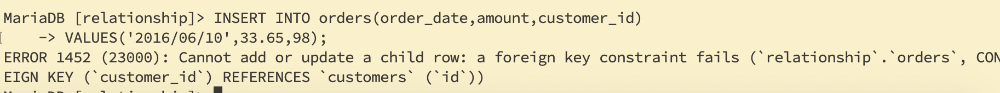
- This INSERT fails because of our fk constraint.  No user with id: 98
---


### Cross join

```sql
SELECT * FROM customers WHERE last_name='George';
SELECT * FROM orders WHERE customers_id=1;

SELECT * FROM orders WHERE customer_id = (
	SELECT id FROM customers
	WHERE last_name='George'
);

SELECT * FROM customers,orders;
```
- we don't use join, but it is good to know
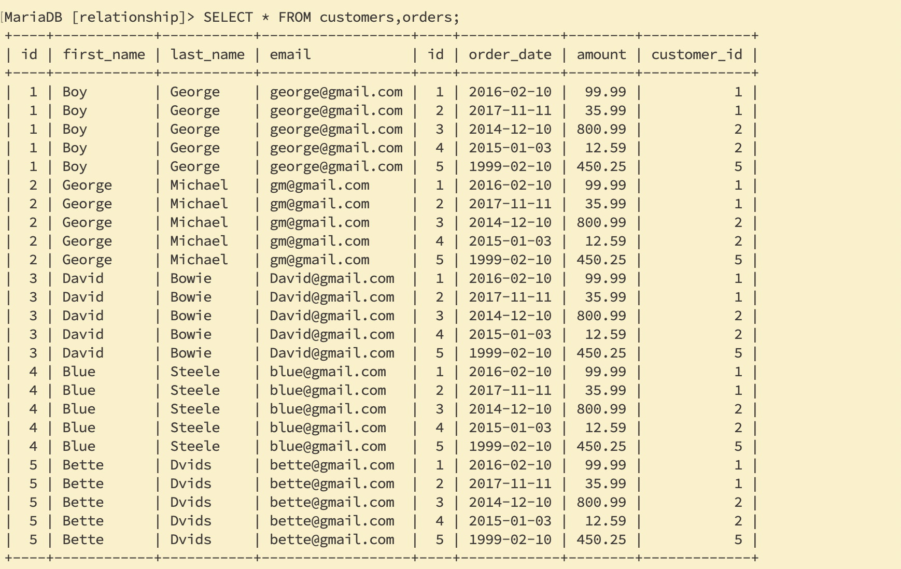
---

### Inner Join
```sql
-- IMPLICIT INNER JOIN

SELECT * FROM customers, orders 
WHERE customers.id = orders.customer_id;
-- IMPLICIT INNER JOIN

SELECT first_name, last_name, order_date, amount
FROM customers, orders 
    WHERE customers.id = orders.customer_id;
    
-- EXPLICIT INNER JOINS

SELECT * FROM customers
JOIN orders
    ON customers.id = orders.customer_id;
    
SELECT first_name, last_name, order_date, amount 
FROM customers
JOIN orders
    ON customers.id = orders.customer_id;
    
SELECT *
FROM orders
JOIN customers
    ON customers.id = orders.customer_id;
-- ARBITRARY JOIN - meaningless, but still possible 

SELECT * FROM customers
JOIN orders ON customers.id = orders.id;
```
---

- we have two ids
```sql
SELECT * FROM customers,orders WHERE id=customer_id;
-- the problem is we have two IDS
```
- so change the above 
`SELECT * FROM customers,orders WHERE customers.id = orders.customer_id;`
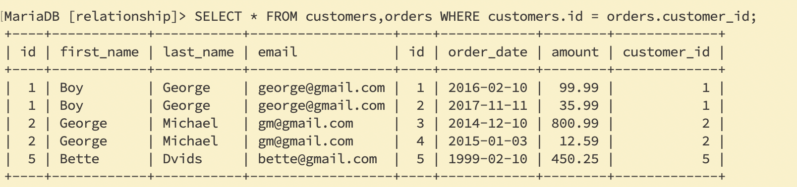
---
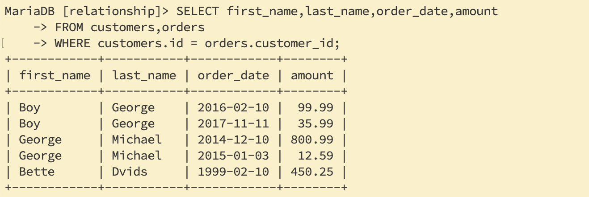
---
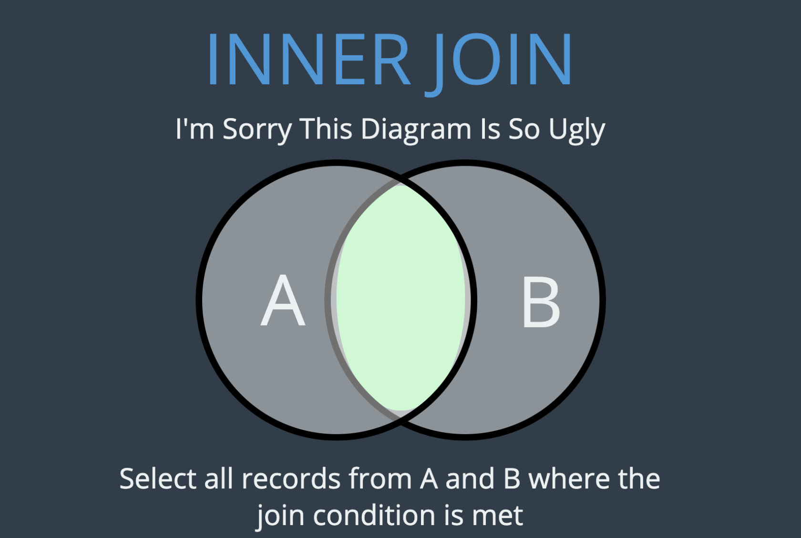
---

- Explicit INNER JOIN
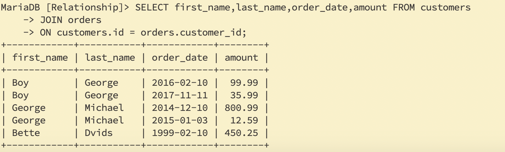
---
```sql
SELECT *
FROM orders
JOIN customers
    ON customers.id = orders.customer_id;
```
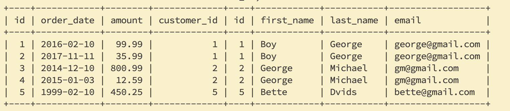
---
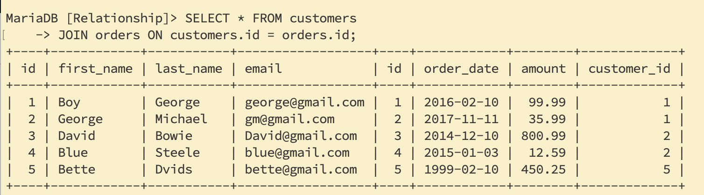


---
### Left Join
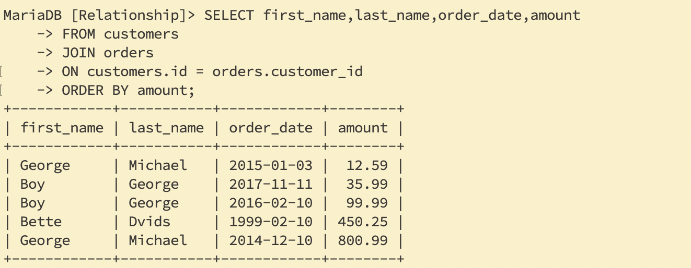
---
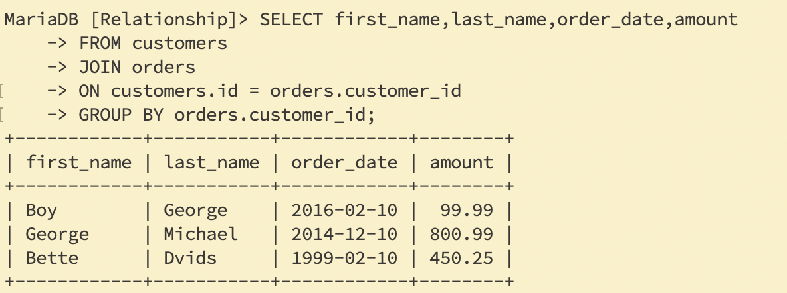
---
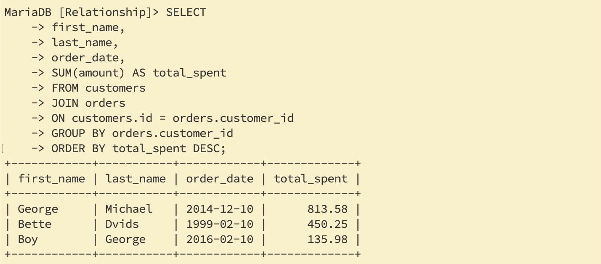
---

```sql
-- Getting Fancier (Inner Joins Still)

SELECT first_name, last_name, order_date, amount 
FROM customers
JOIN orders
    ON customers.id = orders.customer_id
ORDER BY order_date;
SELECT 
    first_name, 
    last_name, 
    SUM(amount) AS total_spent
FROM customers
JOIN orders
    ON customers.id = orders.customer_id
GROUP BY orders.customer_id
ORDER BY total_spent DESC;


-- LEFT JOINS

SELECT * FROM customers
LEFT JOIN orders
    ON customers.id = orders.customer_id;
SELECT first_name, last_name, order_date, amount
FROM customers
LEFT JOIN orders
    ON customers.id = orders.customer_id; 
SELECT 
    first_name, 
    last_name,
    IFNULL(SUM(amount), 0) AS total_spent
FROM customers
LEFT JOIN orders
    ON customers.id = orders.customer_id
GROUP BY customers.id
ORDER BY total_spent;
```